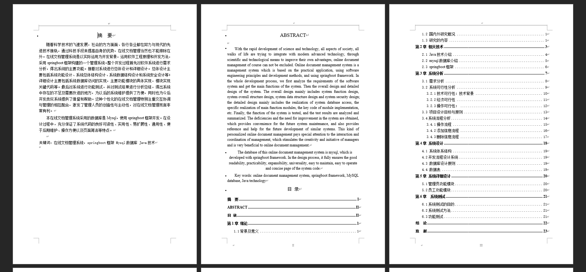
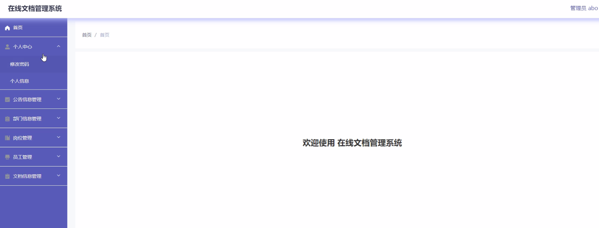
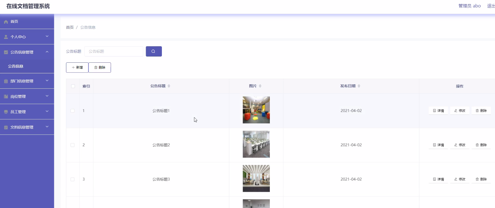
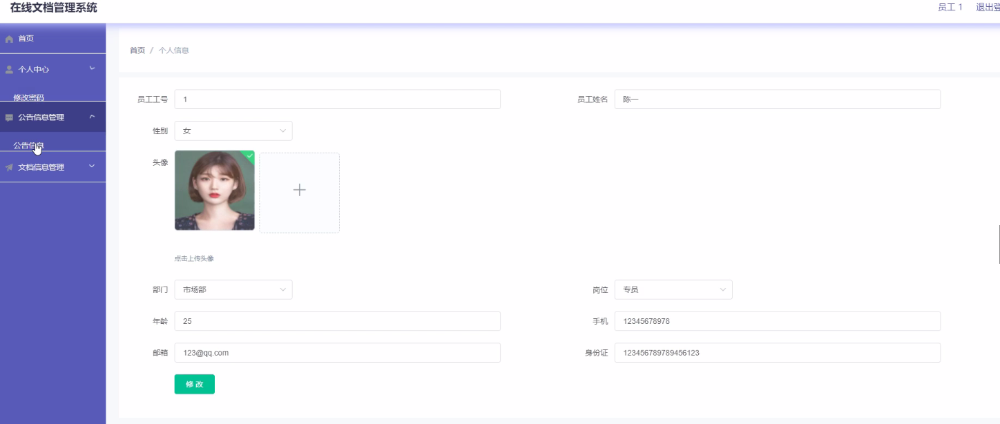

基于Springboot的在线文档管理系统（程序+论文）
=
### 完整代码获取地址：从戎源码网 ([https://armycodes.com/](https://armycodes.com/))
### 作者微信：19941326836  QQ：952045282 
### 承接计算机毕业设计、Java毕业设计、Python毕业设计、深度学习、机器学习
### 选题+开题报告+任务书+程序定制+安装调试+论文+答辩ppt 一条龙服务
### 所有选题地址https://github.com/nature924/allProject

一、项目介绍
---
系统包含两种角色：用户、管理员，系统分为前台和后台两大模块，主要功能如下：
### 1 管理员功能模块

管理员登录  
管理员通过填写注册时输入的用户名、密码和角色进行登录。  

首页  
管理员登录后可以查看首页、个人中心、公告信息管理、部门信息管理、岗位管理、员工管理、文档信息管理等功能。  

公告信息管理  
管理员可以在公告信息管理页面中查看公告标题、图片、发布日期、内容等信息，进行详情查看、修改或删除操作。  

部门信息管理  
管理员可以查看部门、人数等信息，并对部门信息进行详情查看、修改或删除等操作。  

员工管理  
管理员可以查看员工工号、姓名、性别、头像、部门、岗位、年龄、手机、邮箱、身份证等信息，并对员工信息进行详情查看、修改或删除等操作。  

文档信息管理  
管理员可以查看文档名称、类型、介绍、附件、发布日期等信息，并对文档信息进行详情查看、修改或删除等操作。  

### 2 员工功能模块

登录  
员工通过填写工号和密码进行登录。  

首页  
员工登录后可以查看首页、个人中心、公告信息管理、文档信息管理等功能。  

个人中心  
员工可以在个人信息页面中查看和编辑工号、姓名、性别、头像、部门、岗位、年龄、手机、邮箱、身份证等信息。  

文档信息管理  
员工可以在文档信息管理页面中查看文档名称、类型、介绍、附件、发布日期等信息，并根据需要进行下载或详细查看。

二、项目技术
---
- 编程语言：Java
- 数据库：MySQL
- 项目管理工具：Maven
- 前端技术：VUE、HTML、Jquery、Bootstrap
- 后端技术：Spring、SpringMVC、MyBatis

三、运行环境
---
- 操作系统：Windows、macOS都可以
- JDK版本：JDK1.8以上都可以
- 开发工具：IDEA、Ecplise、Myecplise都可以
- 数据库: MySQL5.7以上都可以
- Tomcat：任意版本都可以
- Maven：任意版本都可以

四、运行截图
---
### 论文截图：

### 程序截图：

